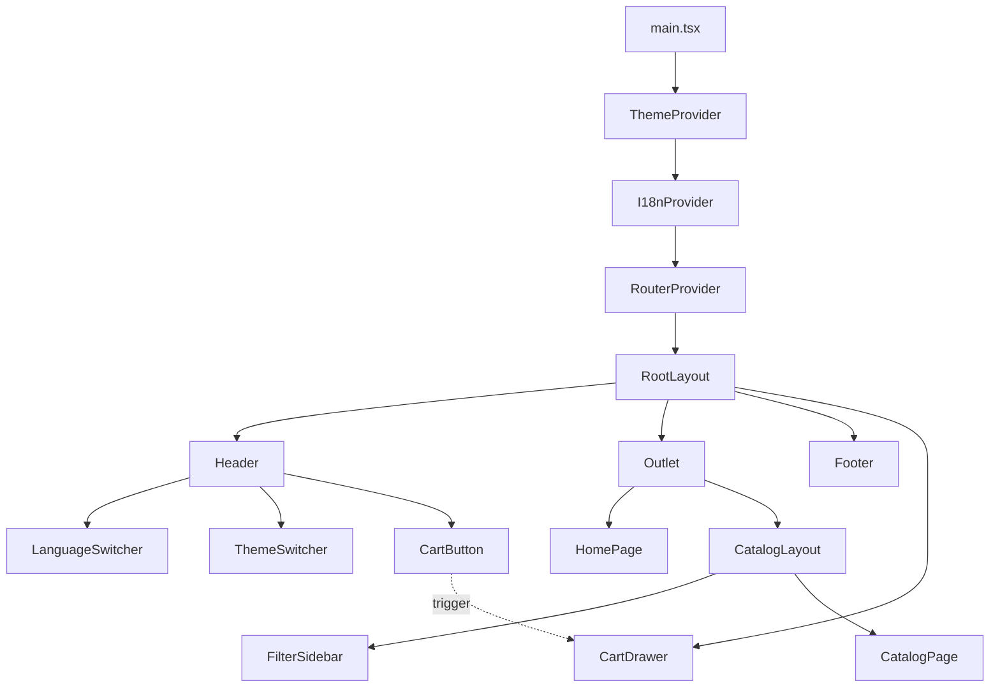

# E-commerce Layout & Theme System

## Kiến trúc tổng quan

### 1. Cấu trúc thư mục (Production-ready)

```
src/
├── components/
│   ├── ui/                    # shadcn/ui primitives (Button, Sheet, DropdownMenu...)
│   ├── layout/                # Layout components
│   │   ├── Header.tsx         # Header với language + theme switcher
│   │   ├── Footer.tsx         # Footer reusable
│   │   ├── RootLayout.tsx     # Layout chung cho tất cả pages
│   │   ├── CatalogLayout.tsx  # Layout có filter sidebar
│   │   └── CartDrawer.tsx     # Cart as Sheet drawer
│   └── shared/                # Shared components (LanguageSwitcher, ThemeSwitcher)
├── features/                  # Feature-based modules
│   ├── home/                  # Home page feature
│   └── catalog/               # Catalog page feature (với FilterSidebar)
├── providers/                 # Context providers
│   ├── ThemeProvider.tsx      # Theme management
│   └── I18nProvider.tsx       # i18n wrapper
├── hooks/                     # Custom hooks
│   ├── use-theme.ts           # useTheme hook
│   └── use-mobile.ts          # useMediaQuery for responsive
├── i18n/                      # Internationalization
│   ├── config.ts              # i18next config
│   └── locales/
│       ├── en/
│       │   ├── common.json
│       │   ├── product.json
│       │   ├── cart.json
│       │   └── checkout.json
│       └── vi/
│           ├── common.json
│           ├── product.json
│           ├── cart.json
│           └── checkout.json
├── routes/
│   └── router.tsx             # React Router v7 config với nested routes
├── types/                     # TypeScript types
└── main.tsx                   # Entry point với providers
```

### 2. Luồng hoạt động



### 3. Theme System

**Approach**: Sử dụng CSS variables có sẵn trong [`src/index.css`](src/index.css) + React Context để quản lý state

**Components cần tạo**:

- `providers/ThemeProvider.tsx`: Context provider quản lý theme (light/dark/system), persist localStorage
- `hooks/use-theme.ts`: Custom hook `useTheme()` để access theme state
- `components/shared/ThemeSwitcher.tsx`: UI toggle theme bằng shadcn DropdownMenu

**Logic**:

1. ThemeProvider đọc theme từ localStorage hoặc system preference
2. Apply class `dark` vào `document.documentElement` khi dark mode
3. CSS variables trong [`src/index.css`](src/index.css) tự động áp dụng màu tương ứng
4. Theme persist khi reload page

### 4. i18n System

**Library**: `react-i18next` + `i18next`

**Components cần tạo**:

- `i18n/config.ts`: Config i18next với fallback language, namespace structure
- `i18n/locales/[lang]/[feature].json`: Translation files theo feature (common, product, cart, checkout)
- `components/shared/LanguageSwitcher.tsx`: UI switch language bằng shadcn DropdownMenu

**Logic**:

1. i18next init với EN/VN translations
2. Language stored trong localStorage (`i18nextLng` key)
3. Không reload page khi switch language (dynamic update)
4. Hook `useTranslation()` từ react-i18next để access translations
5. Namespace theo feature: `t('common:header.cart')`, `t('product:addToCart')`

### 5. Layout System

#### RootLayout (Cho tất cả pages)

- File: `components/layout/RootLayout.tsx`
- Structure:

  ```tsx
  <div className='min-h-screen flex flex-col'>
    <Header />
    <main className='flex-1'>
      <Outlet /> {/* React Router v7 */}
    </main>
    <Footer />
    <CartDrawer />
  </div>
  ```

- Mobile-first: Header collapsible menu (Sheet), responsive nav

#### CatalogLayout (Chỉ cho catalog pages)

- File: `components/layout/CatalogLayout.tsx`
- Structure:

  ```tsx
  <div className='container'>
    <FilterSidebar /> {/* Desktop: sticky sidebar, Mobile: Sheet drawer */}
    <div className='catalog-content'>
      <Outlet /> {/* Catalog pages */}
    </div>
  </div>
  ```

- Responsive: Sidebar hidden trên mobile, show as drawer khi click "Filter" button

#### CartDrawer

- File: `components/layout/CartDrawer.tsx`
- Component: shadcn `Sheet` from right side
- Trigger: Button trong Header
- State: Quản lý bằng React Context (CartContext) - không implement trong phase này

### 6. React Router v7 Configuration

File: [`src/routes/router.tsx`](src/routes/router.tsx)

**Structure**:

```tsx
const router = createBrowserRouter([
  {
    path: '/',
    element: <RootLayout />,
    children: [
      { index: true, element: <HomePage /> },
      {
        path: 'catalog',
        element: <CatalogLayout />,
        children: [
          { index: true, element: <CatalogPage /> },
          { path: ':category', element: <CatalogPage /> },
        ],
      },
      { path: 'product/:id', element: <ProductDetailPage /> },
      { path: 'checkout', element: <CheckoutPage /> },
      { path: 'profile', element: <ProfilePage /> },
    ],
  },
]);
```

**Key Points**:

- Nested routes với `<Outlet />`
- Layouts wrap routes tự động (không import thủ công trong pages)
- RootLayout persist across navigation (Header/Footer không re-render)
- CatalogLayout chỉ active khi vào /catalog/\*

### 7. shadcn/ui Components cần cài

Sử dụng CLI: `npx shadcn@latest add [component]`

**Required components**:

- `button` - Buttons trong UI
- `sheet` - Mobile menu, Cart drawer, Filter drawer
- `dropdown-menu` - Language switcher, Theme switcher
- `separator` - Dividers
- `badge` - Cart item count
- `input` - Filters, search
- `select` - Sorting, filters
- `checkbox` - Filter options
- `slider` - Price range filter

### 8. Dependencies cần thêm

```bash
pnpm add i18next react-i18next i18next-browser-languagedetector
```

---

## Implementation Steps

### Step 1: Cài đặt dependencies và shadcn components

- Cài i18next libraries
- Add các shadcn components cần thiết

### Step 2: Theme System

- Tạo ThemeProvider với logic light/dark/system
- Tạo hook useTheme
- Tạo ThemeSwitcher component

### Step 3: i18n System

- Config i18next với EN/VN
- Tạo translation files structure (common, product, cart, checkout)
- Tạo LanguageSwitcher component
- Wrap app với I18nProvider

### Step 4: Layout Components

- Tạo RootLayout (Header + Footer + Outlet)
- Tạo Header với navigation, cart button, theme + language switchers
- Tạo Footer đơn giản
- Tạo CartDrawer (Sheet từ bên phải)
- Tạo CatalogLayout với FilterSidebar responsive

### Step 5: React Router Configuration

- Cập nhật router.tsx với nested routes
- Wrap RootLayout vào route "/"
- Add các routes con: home, catalog, product/:id

### Step 6: Example Pages

- Tạo HomePage đơn giản với hero section + demo i18n
- Tạo CatalogPage với grid products + filters

### Step 7: Main.tsx Integration

- Wrap app với ThemeProvider → I18nProvider → RouterProvider
- Test theme switching, language switching, navigation

---

## Best Practices Applied

✅ **KISS**: Layouts đơn giản, không business logic

✅ **DRY**: Header/Footer reusable, shared components

✅ **SOLID**: Separation of concerns (layout vs business logic)

✅ **Mobile-first**: CSS responsive, no JS resize listeners

✅ **Accessibility**: Semantic HTML, ARIA labels, keyboard navigation

✅ **Performance**: Layouts không re-render khi navigate

✅ **Type-safe**: Full
